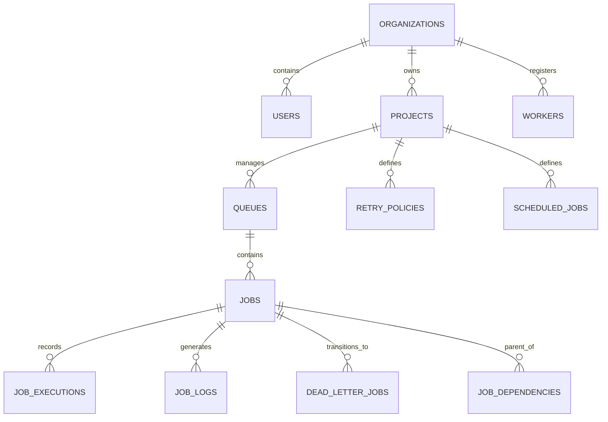

# RunGrid — Database Schema & State Machine Documentation

## Schema Overview

RunGrid uses PostgreSQL as its single source of truth for job persistence, state transitions, organizational boundaries, and audit logging.



## Database Tables

| Table Name | Primary Key | Description | Key Indexes & Constraints |
|---|---|---|---|
| `organizations` | `id` (UUID) | Multi-tenant boundary entity. | `name` (UNIQUE) |
| `users` | `id` (UUID) | Authenticated platform user account. | `email` (UNIQUE), `organization_id` (FK) |
| `projects` | `id` (UUID) | Organizational sub-project context. | `organization_id` (FK) |
| `queues` | `id` (UUID) | Execution channel with priority & concurrency settings. | `project_id` (FK), `name` (UNIQUE per project) |
| `retry_policies` | `id` (UUID) | Strategy for job failure retries (FIXED, LINEAR, EXPONENTIAL). | `project_id` (FK) |
| `jobs` | `id` (UUID) | Core job record tracking state, payload, priority, and lease. | `queue_id` (FK), `(status, priority, available_at)` |
| `scheduled_jobs` | `id` (UUID) | Cron job definitions evaluated by Scheduler service. | `project_id` (FK), `(is_active, next_run_at)` |
| `workers` | `id` (UUID) | Registered worker daemon instance health record. | `organization_id` (FK), `last_heartbeat` |
| `worker_heartbeats` | `id` (UUID) | Periodic heartbeat log for active worker capacity. | `worker_id` (FK), `created_at` |
| `job_executions` | `id` (UUID) | Execution attempt history and timing details. | `job_id` (FK), `worker_id` (FK) |
| `job_logs` | `id` (UUID) | Log output captured during job execution. | `job_id` (FK), `execution_id` (FK) |
| `dead_letter_jobs` | `id` (UUID) | Dead letter archive for permanently failed jobs. | `job_id` (FK) |
| `job_dependencies` | `id` (UUID) | DAG dependency links (`parent_job_id` → `child_job_id`). | `(parent_job_id, child_job_id)` (UNIQUE) |
| `batch_submissions` | `id` (UUID) | Atomic batch grouping metadata. | `project_id` (FK) |

## Job State Machine Dynamics

```
                  ┌───────────────┐
                  │   SCHEDULED   │ (Cron / Delayed)
                  └───────┬───────┘
                          │ (Scheduler / Delay Elapsed)
                          ▼
                  ┌───────────────┐
                  │    QUEUED     │ <────────────┐
                  └───────┬───────┘              │
                          │ (Worker Claim)       │
                          ▼                      │
                  ┌───────────────┐              │ (Reaper Recovery /
                  │    CLAIMED    │              │  Retry Backoff)
                  └───────┬───────┘              │
                          │ (Worker Start)       │
                          ▼                      │
                  ┌───────────────┐              │
                  │    RUNNING    ├──────────────┘
                  └───┬───────┬───┘
                      │       │
            (Success) │       │ (Max Retries Exceeded)
                      ▼       ▼
           ┌───────────┐     ┌───────────────┐
           │ COMPLETED │     │  DEAD_LETTER  │
           └───────────┘     └───────────────┘
```

### Transition & Attempt Rules

- **`QUEUED` → `CLAIMED`**: Worker claims job row (`FOR UPDATE SKIP LOCKED`). Lease timestamp `lease_expires_at` is set. Attempt counter remains unchanged.
- **`CLAIMED` → `RUNNING`**: Worker begins task execution. Attempt counter is incremented (`attempt += 1`). Execution log entry created.
- **`RUNNING` → `COMPLETED`**: Execution completes successfully. Status set to `COMPLETED`, worker lease cleared.
- **`RUNNING` → `RETRY_WAITING`**: Execution failed, but `attempt < max_retries`. Backoff delay calculated and `available_at` set to `now() + backoff_seconds`.
- **`RUNNING` → `DEAD_LETTER`**: Execution failed and `attempt >= max_retries`. Job copied to `dead_letter_jobs` and status marked `DEAD_LETTER`.
- **Lease Expiration (Reaper Recovery)**: If `lease_expires_at < now()` while status is `CLAIMED` or `RUNNING`, the Reaper daemon resets job status to `QUEUED` or `RETRY_WAITING`.

## Atomic Claiming SQL Mechanism

```sql
-- Atomic job selection avoiding lock contention across workers
SELECT j.id
FROM jobs j
JOIN queues q ON j.queue_id = q.id
WHERE j.status = 'QUEUED'
  AND j.available_at <= NOW()
  AND q.is_paused = FALSE
ORDER BY q.priority DESC, j.priority DESC, j.created_at ASC
FOR UPDATE SKIP LOCKED
LIMIT 1;
```
